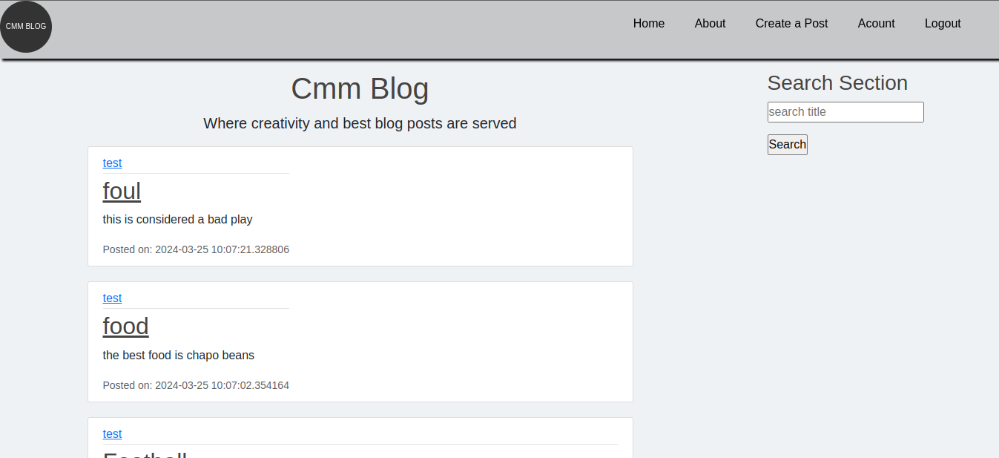

# Cmm Blog post
Cmm blog post is a web app blog for people to write and post for others to read

# Description
The app allows users to create accounts, create posts, update them, delete, view their posts.
The users also are able to see what others have written and able to read.
### Technologies
The technologies used is flask framework for the backend and frontend, there is javascript for the frontend , then for styling i used css and bootstrap and html for the pages.

### challenges
Some challenges i faced were about time. Since i had to do the project on a limited time.
I would like to add some improvement in the future such as a user is able to follow a fellow user, like their post, or even comment on their post

# How to install and run the project
To install and run the program you need to have latest python installed.

### step 1:
you need t git clone the repo
Open your favourite editor and open the folder

### Step 2:
for an easy time you need to have a virtual environment. To have one you need to install it.

python3 -m venv .venv  #the .venv is the you give your virtual environmnt

### Step 3:
you need to install the requiremnts file:

pip install -r requirements.txt

### Step 4:
create a .env file and add the environmental variables:
EMAIL_PASS='password for the email'
EMAIL_USER='username of the email eg example@gmail.com'

SECRET_KEY='secret key to enable form passing'

for the secret key you can have anything as long as is not exposed
for email_pass is the passeord for the email
the email is an smtp email for apps which is created in gmail account

### step 5:
to run the the now do:
python3 app.py

# how to use
First you need to register by creating an account.

After account creation you will be redirected to the login page where you will login

Once you login you will be redirected to the home page where you can see all posts by diefferent user

you will be able to access the naviagtion links such will enable you create a post visit the account page

# Contribution
For contribution you could email me at cartermusee@gmail.com for the details.